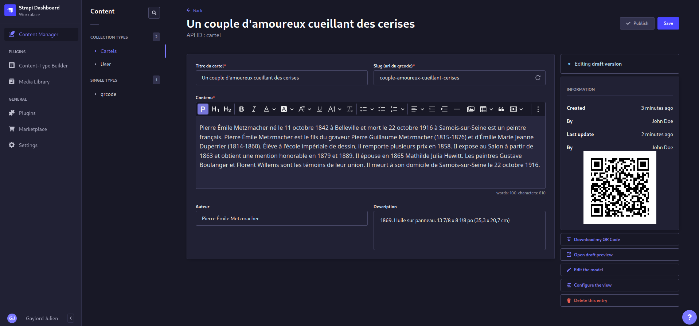

<div align="center">
  
  <h1>Strapi Plugin QR Code Generator</h1>
  <p>This is a plugin that allows you to generate QR Codes based on specific fields or generate QR Codes with Rest API.</p>
  
</div>

## Features

- Output svg qr code with rest api parameters.
- Adds a button to the content manager that allows users to generate a qr code.
- Display qr code on content manager.
- Supports collection and single types.

## How to install

```bash
npm i strapi-plugin-qrcode-generator
or
yarn add strapi-plugin-qrcode-generator
```

## Configuration

Include this to your .env file :

```
STRAPI_BASE_FRONTEND=https://www.example.org
```

To display the download button and qr code, you need to edit or create `config/plugins.js`, for each content type.

For example in the screenshot above, this is enabled :

```js
module.exports = {
  'qrcode-generator': {
    enabled: true,
    config: {
      contentTypes: [
        {
          uid: 'api::cartel.cartel',
          targetField: 'slug',
          frontend: {
            basePath: '/cartels',
          },
        },
      ],
    },
  },
};
```

> Here we get cartel's field slug value, then we provide basePath's value inside frontend so that the downloaded qr code from the content manager includes it.

## REST API

You can also get qr codes by querying qrcode-generator endpoint :

## API Reference

#### Endpoint

```http
  GET /qrcode-generator
```

| Parameter       | Description          |
| :-------------- | :------------------- |
| `download=true` | Make it downloadable |
| `filename=`     | Filename of the file |
| `url=`          | Url to encode        |

Example:

```
http://localhost:1337/qrcode-generator?url=www.example.org&filename=example-qrcode&download=true
```

## Roadmap

- Additional qr code configs for rest api
- Additional params for rest api
